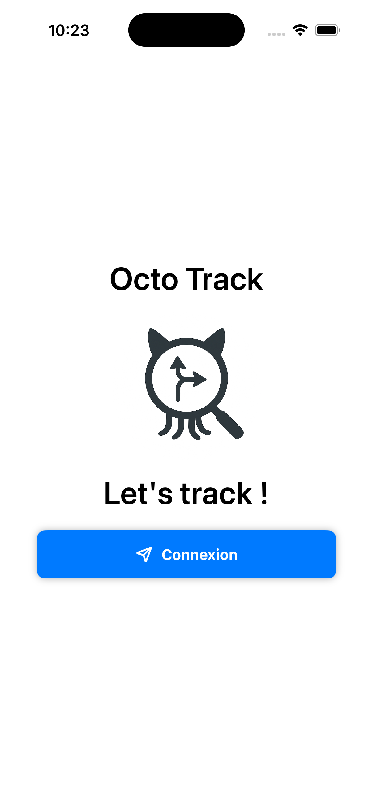
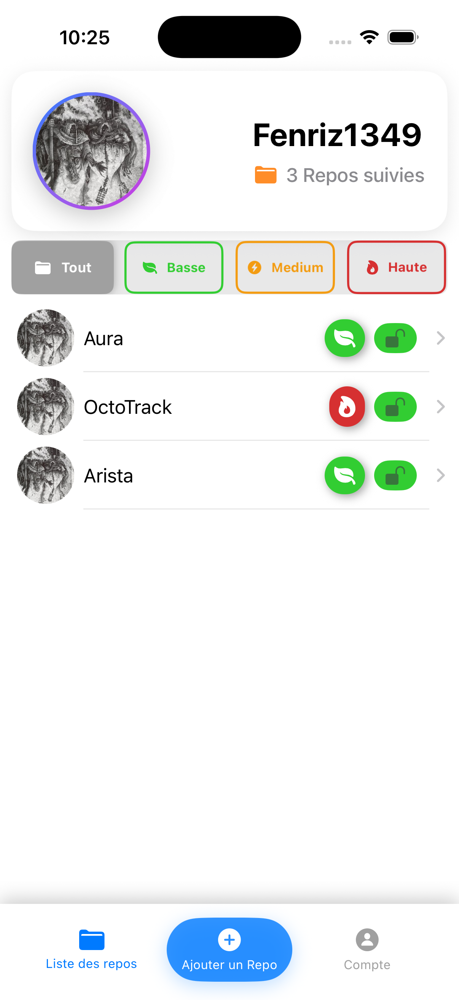
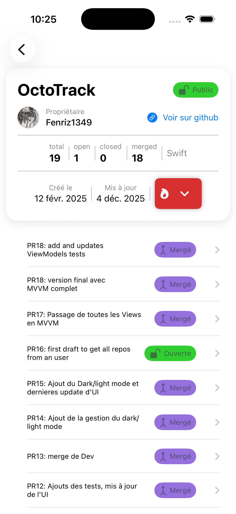
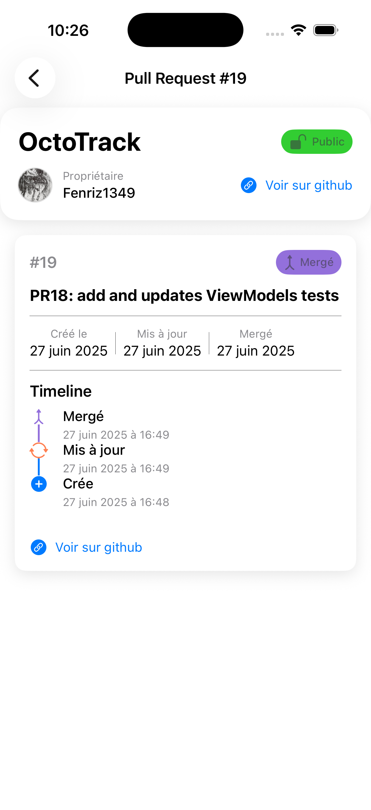

# 🐙 OctoTrack

<div align="center">


*A modern iOS app to track and manage your GitHub repositories and pull requests*

[Features](#-features) • [Architecture](#-architecture) • [Installation](#-installation) • [Usage](#-usage) • [Requirements](#-requirements)

</div>

---

## 📱 Overview

OctoTrack is a native iOS application that helps developers monitor their GitHub repositories and pull requests efficiently. Built with SwiftUI and following clean architecture principles, it provides a seamless experience for tracking project activity across multiple repositories.

## ✨ Features

### 🔐 Authentication
- GitHub OAuth 2.0 integration
- Secure token management with Keychain
- Automatic token validation and refresh
- Session persistence

### 📦 Repository Management
- Add and track multiple GitHub repositories
- Priority system (Low, Medium, High)
- Public/Private repository support
- Repository filtering by priority
- Quick repository deletion with swipe actions

### 🔄 Pull Request Tracking
- Real-time PR status monitoring (Open, Closed, Merged)
- Detailed PR timeline visualization
- Pull request metadata (created, updated, merged dates)
- Draft PR identification
- Pull-to-refresh functionality
- Direct links to GitHub

### 👤 User Interface
- Clean, modern SwiftUI design
- Dark mode support
- Custom tab bar navigation
- Responsive animations
- Localized in English and French 🇬🇧 🇫🇷

## 🏗 Architecture

OctoTrack follows **MVVM (Model-View-ViewModel)** architecture with clean separation of concerns:
```
OctoTrack/
├── 📁 Models/              # Data models (User, Repository, PullRequest)
├── 📁 Views/               # SwiftUI views
├── 📁 ViewModels/          # Business logic and state management
├── 📁 Network/             # API clients and endpoints
│   ├── Authentication/     # OAuth flow
│   ├── Repositories/       # Repository endpoints
│   ├── PullRequests/       # PR endpoints
│   └── Users/             # User endpoints
├── 📁 Storage/            # Keychain and token management
├── 📁 DataManager/        # SwiftData persistence layer
└── 📁 ExtractedViews/     # Reusable UI components
```

### Key Design Patterns

- **Factory Pattern**: `ViewModelFactory` for dependency injection
- **Repository Pattern**: `UserDataManager` for data access
- **Coordinator Pattern**: `AppCoordinator` for navigation
- **Mapper Pattern**: DTOs to domain model conversion

## 🛠 Technologies

| Component | Technology |
|-----------|-----------|
| **UI Framework** | SwiftUI |
| **Persistence** | SwiftData |
| **Networking** | URLSession + async/await |
| **Authentication** | ASWebAuthenticationSession |
| **Secure Storage** | Keychain Services |
| **Architecture** | MVVM + Clean Architecture |
| **Concurrency** | Swift Concurrency (async/await) |

## 📋 Requirements

- iOS 17.0+
- Xcode 15.0+
- Swift 5.9+
- GitHub account
- GitHub OAuth App credentials

## 🚀 Installation

### 1. Clone the Repository
```bash
git clone https://github.com/yourusername/OctoTrack.git
cd OctoTrack
```

### 2. Configure GitHub OAuth

1. Create a GitHub OAuth App:
   - Go to GitHub Settings → Developer settings → OAuth Apps
   - Register a new application
   - Set callback URL to: `octotrack://callback`

2. Update credentials in `GitHubAuthenticationEndpoint.swift`:
```swift
static let config = GitHubOAuthConfig(
    clientID: "YOUR_CLIENT_ID",
    clientSecret: "YOUR_CLIENT_SECRET",
    redirectURI: "octotrack://callback",
    scopes: ["repo", "user"]
)
```

⚠️ **Security Note**: Never commit your OAuth credentials to version control!

### 3. Build and Run

1. Open `OctoTrack.xcodeproj` in Xcode
2. Select your target device or simulator
3. Build and run (⌘R)

## 💡 Usage

### Getting Started

1. **Launch the app** and tap "Sign In"
2. **Authenticate** with your GitHub account
3. **Add repositories** using the + button
4. **Track pull requests** by tapping on any repository
5. **Filter** repositories by priority level

### Managing Repositories

- **Add Repository**: Tap the center `+` button, enter owner and repo name
- **Delete Repository**: Swipe left on any repository
- **Update Priority**: Tap the priority badge in repository details
- **Refresh PRs**: Pull down to refresh pull request list
- **View Details**: Tap any PR to see timeline and metadata

### Account Management

- **View Profile**: Navigate to Account tab
- **Reset Repositories**: Clear all tracked repositories
- **Sign Out**: Disconnect from GitHub

## 🔒 Security

- OAuth tokens stored securely in iOS Keychain
- Token expiration handling with automatic refresh
- Periodic token validation (every 30 minutes)
- No credentials stored in UserDefaults or plain text

## 🌐 API Integration

OctoTrack integrates with the GitHub REST API v3:

- **Authentication**: OAuth 2.0 flow
- **Endpoints Used**:
  - `/user` - User information
  - `/repos/{owner}/{repo}` - Repository details
  - `/repos/{owner}/{repo}/pulls` - Pull requests

All network requests use modern Swift Concurrency (async/await).

## 📸 Screenshots

Below are a few screenshots showcasing the main modules of Octotrack.

### ↗️ Authentication
<p align="center">
  
</p>

### 📁 Repository List
<p align="center">
  
</p>

### 🧑‍💻 Repository
<p align="center">
  
</p>

### 🔎 Pull Request
<p align="center">
  
</p>

## 🎨 Customization

### Priority Colors

Edit `RepoPriority.swift` to customize priority colors:
```swift
var color: Color {
    switch self {
    case .low: .customGreen
    case .medium: .customYellow
    case .high: .customRed
    }
}
```

### Localization

Add new languages by extending `Localizable.xcstrings` with your locale.

## 🐛 Known Issues

- Token validation requires active network connection
- Large repository lists may experience slight loading delays
- OAuth flow requires Safari for authentication

## 👨‍💻 Development

### Running Tests
```bash
# Run unit tests
⌘U in Xcode
```

### Code Style

- SwiftLint configuration included
- Follow Swift API Design Guidelines
- MVVM architecture enforced

## 📄 License

This project is licensed under the MIT License - see the [LICENSE](LICENSE) file for details.

## 🙏 Acknowledgments

- GitHub API for comprehensive developer tools
- SwiftUI community for inspiration and support
- Apple for excellent documentation

<div align="center">

⭐ Star this repo if you find it helpful!

</div>
